# Automating-Load-Balancer-Configuration-with-Shell-Scripting

This project demonstrates my ability to automate and setup the maintainance of our load balancer with ease using shell scripting, thereby enhancing efficiency and reducing manual effort. Here we begin by provisioning 3 Ubuntu EC2 instances by setting 2 as servers and installing Nginx on the third to serve as a load balanceras shown below 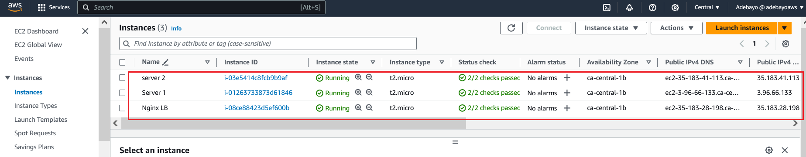 we proceed to set the security group of the server EC2 instances by openning port `8000` and while opening port `80` on the Nginx load balancer EC2 instance as shown below 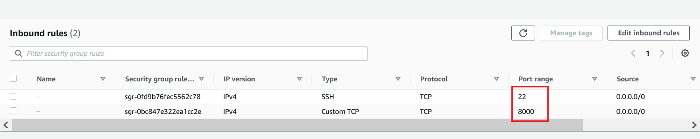 and 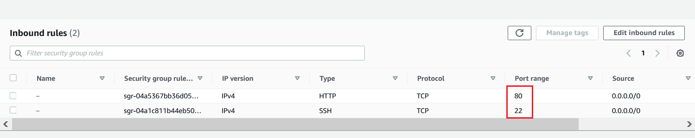

We then proceed to connect to the three instances using SSH and then run shell script on them.

## Deploying and Configuring Web Servers

To deploy and configure the web servers using shell scripting we run `    sudo vi install.sh` and then paste and save the following command for both server instances 
```
{
#!/bin/bash

####################################################################################################################
##### This automates the installation and configuring of apache webserver to listen on port 8000
##### Usage: Call the script and pass in the Public_IP of your EC2 instance as the first argument as shown below:
######## ./install_configure_apache.sh 127.0.0.1
####################################################################################################################

set -x # debug mode
set -e # exit the script if there is an error
set -o pipefail # exit the script when there is a pipe failure

PUBLIC_IP=$1

[ -z "${PUBLIC_IP}" ] && echo "Please pass the public IP of your EC2 instance as an argument to the script" && exit 1

sudo apt update -y &&  sudo apt install apache2 -y

sudo systemctl status apache2

if [[ $? -eq 0 ]]; then
    sudo chmod 777 /etc/apache2/ports.conf
    echo "Listen 8000" >> /etc/apache2/ports.conf
    sudo chmod 777 -R /etc/apache2/

    sudo sed -i 's/<VirtualHost \*:80>/<VirtualHost *:8000>/' /etc/apache2/sites-available/000-default.conf

fi
sudo chmod 777 -R /var/www/
echo "<!DOCTYPE html>
        <html>
        <head>
            <title>My EC2 Instance</title>
        </head>
        <body>
            <h1>Welcome to my EC2 instance</h1>
            <p>Public IP: "${PUBLIC_IP}"</p>
        </body>
        </html>" > /var/www/html/index.html

sudo systemctl restart apache2


}
```
as shown below 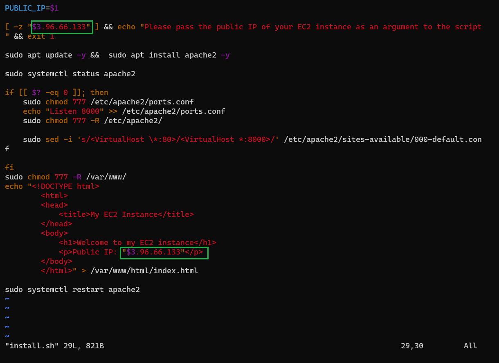

Then we change the permission on the file to make them executable by running `sudo chmod +x install.sh` and then we run the shell script by running `./install.sh PUBLIC_IP` command  as shown below 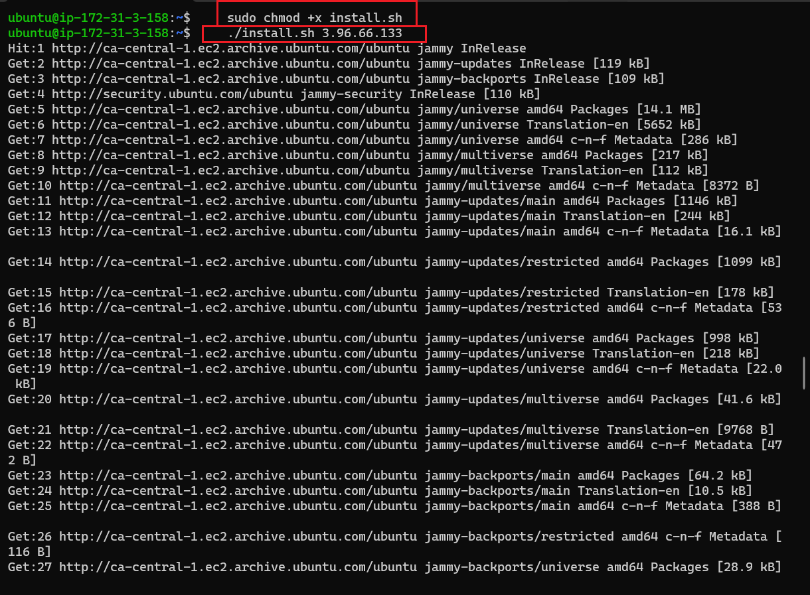

We then paste the public IP of each server on our web browser with the port `:8000` to get the following 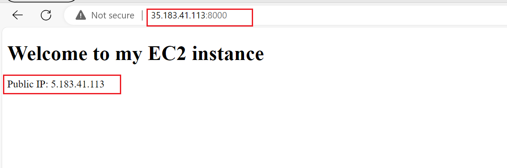 and 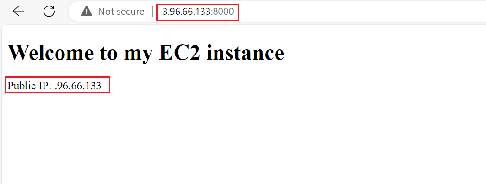

## Deployment of Nginx as a Load Balancer using Shell Script

Having deployed and configured two web servers, we will now move on to the load balancer. After connecting to the instance via SSH, we will open a file nginx.sh by running `sudo vi nginx.sh` we then paste and save the following shell script command 
```
{

#!/bin/bash

######################################################################################################################
##### This automates the configuration of Nginx to act as a load balancer
##### Usage: The script is called with 3 command line arguments. The public IP of the EC2 instance where Nginx is installed
##### the webserver urls for which the load balancer distributes traffic. An example of how to call the script is shown below:
##### ./configure_nginx_loadbalancer.sh PUBLIC_IP Webserver-1 Webserver-2
#####  ./configure_nginx_loadbalancer.sh 127.0.0.1 192.2.4.6:8000  192.32.5.8:8000
############################################################################################################# 

PUBLIC_IP=$1
firstWebserver=$2
secondWebserver=$3

[ -z "${PUBLIC_IP}" ] && echo "Please pass the Public IP of your EC2 instance as the argument to the script" && exit 1

[ -z "${firstWebserver}" ] && echo "Please pass the Public IP together with its port number in this format: 127.0.0.1:8000 as the second argument to the script" && exit 1

[ -z "${secondWebserver}" ] && echo "Please pass the Public IP together with its port number in this format: 127.0.0.1:8000 as the third argument to the script" && exit 1

set -x # debug mode
set -e # exit the script if there is an error
set -o pipefail # exit the script when there is a pipe failure


sudo apt update -y && sudo apt install nginx -y
sudo systemctl status nginx

if [[ $? -eq 0 ]]; then
    sudo touch /etc/nginx/conf.d/loadbalancer.conf

    sudo chmod 777 /etc/nginx/conf.d/loadbalancer.conf
    sudo chmod 777 -R /etc/nginx/

    
    echo " upstream backend_servers {

            # your are to replace the public IP and Port to that of your webservers
            server  "${firstWebserver}"; # public IP and port for webserser 1
            server "${secondWebserver}"; # public IP and port for webserver 2

            }

           server {
            listen 80;
            server_name "${PUBLIC_IP}";

            location / {
                proxy_pass http://backend_servers;   
            }
    } " > /etc/nginx/conf.d/loadbalancer.conf
fi

sudo nginx -t

sudo systemctl restart nginx


}
```
as shown below 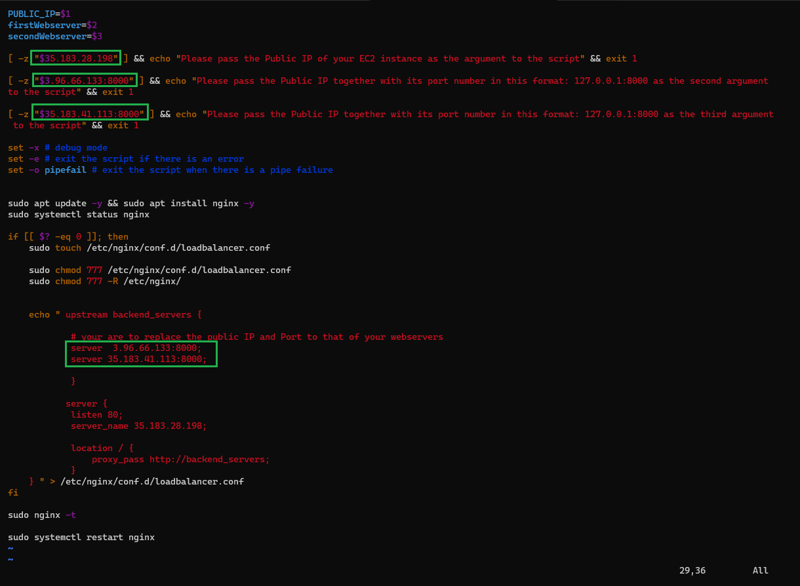

Then we change the permission on the file to make them executable by running `sudo chmod +x nginx.sh` command as shown below 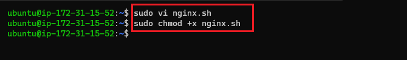

finnally we run the shell script by running `./nginx.sh PUBLIC_IP Webserver-1 Webserver-2` command  as shown below 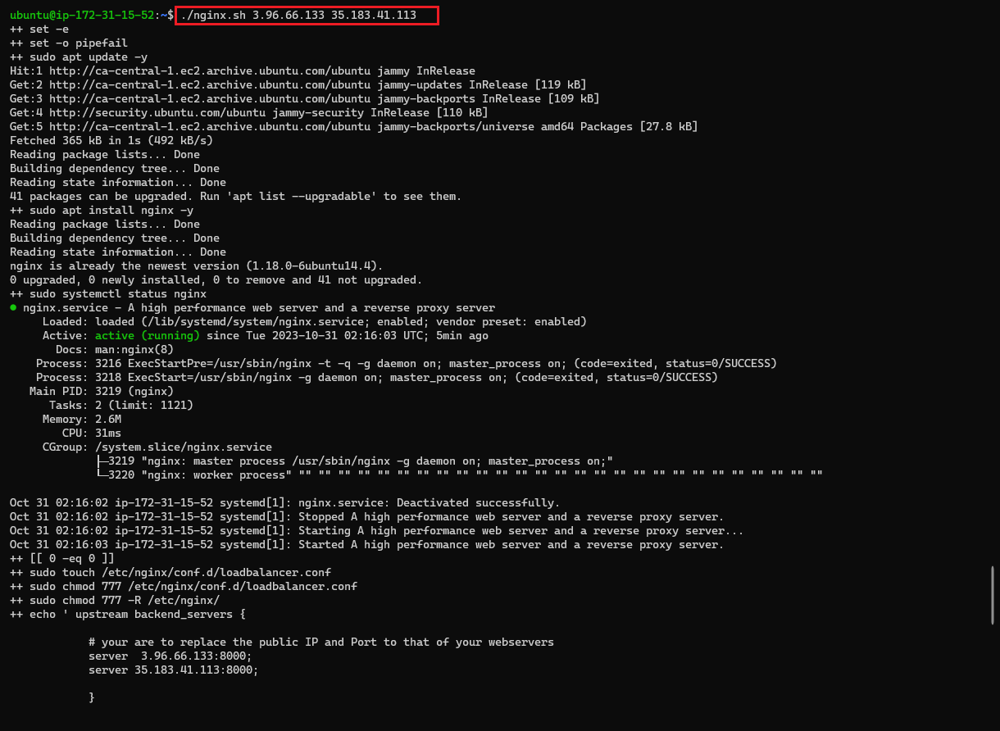

## Verifying the Setup
We then paste the public IP of the Nginx Load balancer server on our browser to toduce the following result at every refresh, thereby load balancing the request between our servers as shown below 
### Screenshot for server 1
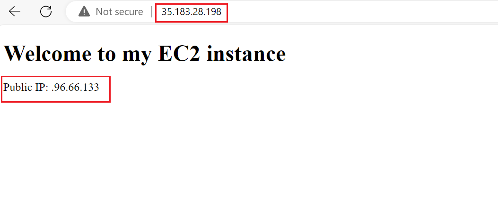
### Screenshot for server 2
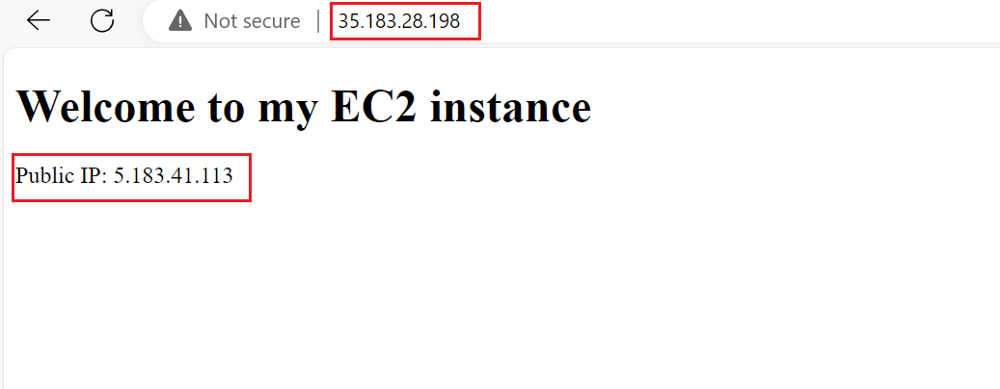